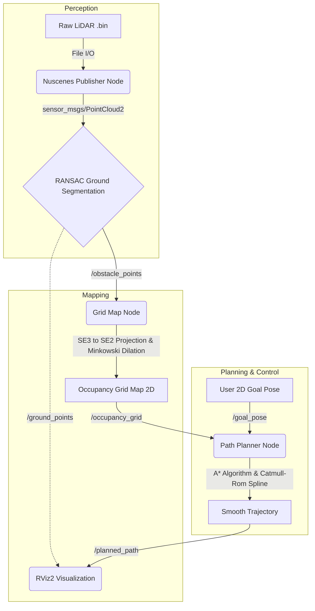

# 🚗 Autonomous Driving: 3D Point Cloud to Local Path Planning

## 📌 Project Overview
자율주행 환경에서 원시 3D LiDAR 데이터(nuScenes)를 입력받아 주행 가능 영역을 인식하고, 실시간으로 장애물을 회피하는 최적의 로컬 경로(Local Path)를 생성하는 통합 ROS 2 파이프라인 구축 프로젝트입니다. 

단순한 알고리즘 구현을 넘어 Perception, Mapping, Planning으로 이어지는 각 모듈을 독립적인 C++ 노드로 구성하여 실시간 데이터 스트리밍 및 시각화(RViz2) 시스템을 완성했습니다.

## 🏗️ System Architecture & Data Flow

시스템은 크게 3개의 독립적인 ROS 2 Node로 구성되며, Topic 기반의 비동기 메시지 패싱 구조를 가집니다.

## 🧠 Core Algorithms & Pipeline
1. 3D Ground Segmentation (RANSAC)
  - 3차원 공간의 평면 방정식(ax + by + cz + d = 0)을 모델링하여 무작위 샘플링 기반의 RANSAC 알고리즘 적용.
  - 단순한 Z축 임계값 필터링이 아닌, 기하학적 수식을 통해 지면(Ground)과 장애물(Obstacle) 포인트를 수학적으로 정밀하게 분리.
2. 2D Occupancy Grid Mapping & C-Space Dilation
  - 분리된 3D 장애물 포인트를 Bird's Eye View(BEV) 평면으로 투영하여 2D 격자 지도로 압축 연산.
  - Minkowski Addition: 로봇의 물리적 크기(안전 반경)를 고려해 장애물 맵 자체를 팽창시켜 1m 이상의 안전거리를 강제로 확보(Configuration Space 변환).
  - 차량의 초기 위치(Ego Footprint) 주변의 노이즈로 인해 경로 탐색이 차단되는 문제를 해결하기 위한 강제 클리어런스 로직 구현.
3. A* Path Planning & Cubic Spline Smoothing
  - f(n) = g(n) + h(n) 비용 함수와 우선순위 큐(Priority Queue)를 활용한 A* 최단 경로 탐색 알고리즘 구현.
  - 도출된 격자 기반의 지그재그 이산 경로에 Catmull-Rom Spline 3차 다항식 보간법을 적용, 1차 미분(속도)이 연속되는 매끄러운 주행 궤적(Smooth Trajectory) 도출.

## 💡 Acquired Skills & Knowledge

📐 Mathematical Modeling & 3D Perception
- 알고리즘 최적화: 기초적인 프로그래밍을 넘어, 선형 대수 및 기하학적 수식을 코드로 변환하여 3차원 공간 투영 및 평면 근사(RANSAC) 모델링을 정밀하게 구현하는 수학적 최적화 역량 확보.
- 곡선 보간(Interpolation): 행렬 역연산 없이 제어점(Control Points)만으로 연속된 궤적을 깎아내는 3차 다항식 스플라인 이론 체득 및 적용.

⚙️ System Integration & Modern C++
- ROS 2 Architecture: 퍼블리셔-서브스크라이버 패턴을 활용한 비동기 통신 노드 설계 및 토픽 간의 라이프사이클 관리.
- C++17 Memory Management: std::shared_ptr와 PCL(Point Cloud Library) 포인터 시스템을 활용한 대용량 점군 데이터의 안전한 메모리 제어.

🐳 DevOps & Environment Isolation
- Containerized Development: 의존성 충돌 방지를 위한 Docker 기반의 개발 환경 구축.
- WSL2 트러블슈팅: 호스트 머신(Windows/Mac)과 Linux 컨테이너 간의 네트워크 브리지 및 X11 포워딩을 통한 RViz2 GUI 시각화 환경 세팅 및 디버깅.
